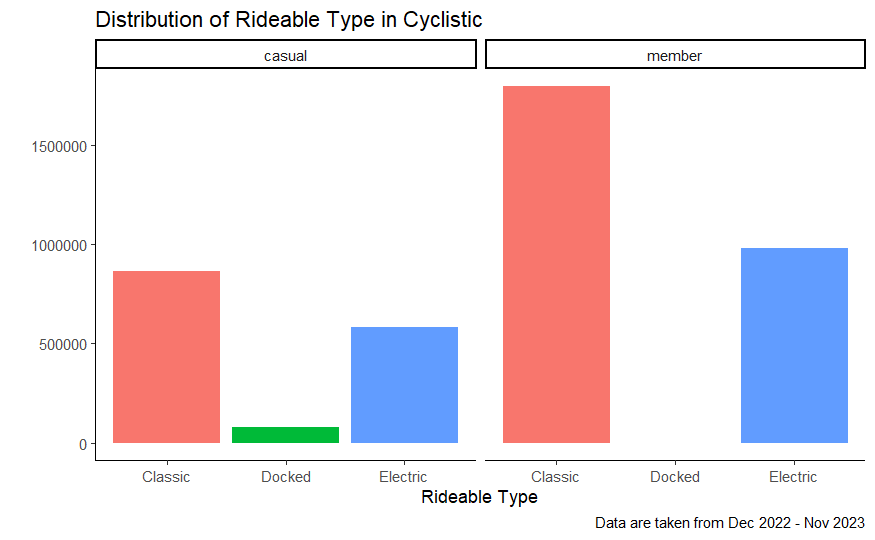

# Google Data Analytics Case study: How does a bike-share navigate speedy success?

This is my capstone project for Google's Data Analytics Professional Certificate.

Tools used:
- R

Install package
```{r}
install.packages("tidyverse")
library(tidyverse)
```

# Table of Contents

1. [Introduction](#1-introduction)
2. [Scenario](#2-scenario)
3. [Data Analysis](#3-data-analysis)
    1) [Ask](#1-ask)
    2) [Prepare](#2-prepare)
    3) [Process](#3-process)
    4) [Analyze](#4-analyze)
    5) [Share](#5-share)
    6) [Act](#6-act)

# 1. Introduction
This is a case study for completing [Google Data Analytics Professional Certificate](https://www.coursera.org/professional-certificates/google-data-analytics). In this case study, you work for a fictional company, Cyclistic. Design marketing strategies aimed at converting casual riders into annual members. In order to do that, however, the team needs to better understand how annual members and casual riders differ, why casual riders would buy a membership, and how digital media could affect their marketing tactics. 

# 2. Scenario
As a junior data analyst working on the marketing analyst team at Cyclistic, a bike-share company, the director of marketing believes the company’s future success depends on **maximizing the number of annual memberships**. Therefore, the team wants to understand how casual riders and annual members use Cyclistic bikes differently. From these insights, the team will design a new marketing strategy to convert casual riders into annual members.The Cyclistic executives must approve the recommendations first, so they must be backed up with compelling data insights and professional data visualizations. 

# 3. Data Analysis
This case study will be using the 6 stages of the data analysis process:

1. [Ask](#1-ask)
2. [Prepare](#2-prepare)
3. [Process](#3-process)
4. [Analyze](#4-analyze)
5. [Share](#5-share)
6. [Act](#6-act)

## 1) Ask
Three questions will guide the future marketing program:

1. How do annual members and casual riders use Cyclistic bikes differently?
2. Why would casual riders buy Cyclistic annual memberships?
3. How can Cyclistic use digital media to influence casual riders to become members?

For the study case, the marketing director, who is also the manager, assigned me the first question to answer: **How do annual members and casual riders use Cyclistic bikes differently?**

## 2) Prepare
**Source**: For the purposes of this case study, the datasets that has been made available by Motivate International Inc. will be used for analysis. ([Dataset](https://divvy-tripdata.s3.amazonaws.com/index.html))

**Date Range**: December 2022 to November 2023

There are 12 files following the name template of "*yyyymm-divvy-tripdata*". All of the files shares the same columns:

| columns       |                    |           |               |
|---------------|--------------------|-----------|---------------|
| ride_id       | start_station_name | start_lat | member_casual |
| rideable_type | start_station_id   | start_lng |               |
| started_at    | end_station_name   | end_lat   |               |
| ended_at      | end_station_id     | end_lng   |               |

## 3) Process
The data are uploaded in R and combined using `bind_rows` from `dplyr` library in R.
```{r upload data, message=FALSE, warning=FALSE}

df_202212 <- read_csv("divvy-tripdata/202212-divvy-tripdata.csv")
df_202301 <- read_csv("divvy-tripdata/202301-divvy-tripdata.csv")
df_202302 <- read_csv("divvy-tripdata/202302-divvy-tripdata.csv")
df_202303 <- read_csv("divvy-tripdata/202303-divvy-tripdata.csv")
df_202304 <- read_csv("divvy-tripdata/202304-divvy-tripdata.csv")
df_202305 <- read_csv("divvy-tripdata/202305-divvy-tripdata.csv")
df_202306 <- read_csv("divvy-tripdata/202306-divvy-tripdata.csv")
df_202307 <- read_csv("divvy-tripdata/202307-divvy-tripdata.csv")
df_202308 <- read_csv("divvy-tripdata/202308-divvy-tripdata.csv")
df_202309 <- read_csv("divvy-tripdata/202309-divvy-tripdata.csv")
df_202310 <- read_csv("divvy-tripdata/202310-divvy-tripdata.csv")
df_202311 <- read_csv("divvy-tripdata/202311-divvy-tripdata.csv")
```
```{r combine data}
df <- bind_rows(df_202212,
                df_202301,
                df_202302,
                df_202303,
                df_202304,
                df_202305,
                df_202306,
                df_202307,
                df_202308,
                df_202309,
                df_202310,
                df_202311)
```

#### Add `ride_length` and `day_of_week` columns

We need to add some columns for further analysis, 

- `ride_length` = `started_at` - `ended_at`
- `day_of_week` = extract day of week from `started_at` (1 = Sunday)
- 
```{r}
df <- mutate(df, 
            ride_length = difftime(ended_at, started_at, units = "secs"),
            day_of_week = wday(df$started_at))
glimpse(df)
```

## 4) Analyze
```{r}
glimpse(df)
```
The combined data has 5,677,610 data rows and 15 columns.

### Data Cleaning
We need to check if there are any duplicate data and missing values. 
```{r}
df[duplicated(df$ride_id),]
```
There are no duplicated ride_id, hence there are no duplicated row.


```{r}
sum(is.na(df))
```
However, the data has 3,597,481 missing values.
```{r}
missing_val <- sapply(df, function(col) sum(is.na(col)))
miss_val <- data.frame(
  missing_values = missing_val
)
miss_val
```
- 869,289 missing values at `start_station_name` column
- 869,421 missing values at `start_station_id` column
- 922,436 missing values at `end_station_name` column
- 922,577 missing values at `end_station_id` column
- 6,879 missing values at `end_lat` column
- 6,879 missing values at `end_lng` column

We need to check how many rows with missing values at 

- `start_station_name` and `start_station_id` 
- `end_station_name` and `end_station_id` 
- `end_lat` and `end_lng`

to see if imputing the missing values is necessary or not.
```{r message=FALSE}
nrow(filter(df, 
            is.na(start_station_name),
            is.na(start_station_id)))

nrow(filter(df, 
            is.na(end_station_name),
            is.na(end_station_id)))
```
Seems like for every missing values at `station_name`, the `station_id` is also missing. The number of rows where `station_id` has missing values, but have values at `station_name` is also small (~136.5).
```{r message=FALSE}
nrow(filter(df, 
            !is.na(start_station_name),
            is.na(start_station_id)))
nrow(filter(df, 
            !is.na(end_station_name),
            is.na(end_station_id)))
```
Every missing values at `end_lat` also have missing values at `end_lng`, so it is not missing at random.
```{r message=FALSE}
nrow(filter(df, 
            is.na(end_lat),
            is.na(end_lng)))
```
We can check if the `end_lat` and `end_lang` can be imputed using `end_station_name`. Imputing `end_lat` and `end_lng` is not necessary because the number of rows where they have `end_station_name` is small (116).
```{r message=FALSE}
nrow(filter(df, 
            is.na(end_lat),
            is.na(end_lng),
            !is.na(end_station_name)))
```
So, imputing missing values is not necessary and can be dropped because most of the missing values cannot be imputed using another feature.

#### Remove rows containing NA
```{r}
df <- na.omit(df)
```

#### Remove outliers
Remove row where

- `ride_length` <= 0

```{r}
df_cleaned <- df %>% 
              filter(ride_length > 0)

nrow(df) - nrow(df_cleaned)
```

### Analysis
#### Data Exploration
```{r}
glimpse(df_cleaned)
```
The combined data has 4,299,413 data rows and 15 columns after cleaning. 

Let's see the average `ride_length` for members and casual riders.
```{r}
df_cleaned %>% 
  group_by(member_casual) %>% 
  summarize(avg_ride_length=mean(ride_length))
```

- casual rider have average ride length of 1375.6177 seconds (22.92696167 minutes)
- member rider have average ride length of 727.3618 seconds (12.1226967 minutes)

Now, for the average `ride_length`for users by `day_of_week`
```{r}
df_cleaned %>% 
  group_by(day_of_week) %>% 
  summarize(avg_ride_length=mean(ride_length))
```

And for the number of rides by `day_of_week`
```{r}
df_cleaned %>% 
  group_by(day_of_week) %>% 
  summarize(num_of_rides = n())
```

## 5) Share

### Distribution of Member and Casual rider in Cyclistic


Takeaway:

- 64.5% of number of rides are from member rider, while 35.5% are from casual rider.

### Number of Rides by Day


Takeaway:

- Casual rider use the bike-share mostly on the weekend, while member rider on the weekday.

### Average Ride Duration by Day


Takeaway:

- Casual rider have longer average ride duration than member rider in Cyclistic.
- Casual rider average ride duration is lower on the weekday than on the weekend.
- Member rider average ride duration is stagnant on the weekday and higher on the weekend.

### Distribution of Rideable Type in Cyclistic


Takeaway:

- The docked bike type has not been used by the member rider.
- The distribution is similar, from highest to lowest usage, classic bike, electric bike, and then docked bike.

### Summary:

**Casual rider**
Casual rider are the minority class on the Cyclistic bike-share program. Casual rider have a preference to use the bike-share on the weekend than on the weekday, their rate of using the bike-share decreases through the mid of the weekday and increases through the end of the weekday until the weekend. Compared to the member rider, they have approximately two times higher average ride duration. The distribution of rideable type they use is similar to the member rider.

**Member rider**
Member rider are the majority class on the Cyclistic bike-share program. Member rider have a preference to use the bike-share on the weekend than on the weekday, their rate of using the bike-share plateaued on the weekday and increases at the weekend. Compared to the casual rider, they have a lower average ride duration.The distribution of rideable type they use is similar to the member rider.

## 6) Act

- Giving a discount for extended ride durations only for the members, could possibly encourage casual riders to join the membership and use it more often and also encourage members to ride for longer periods.
