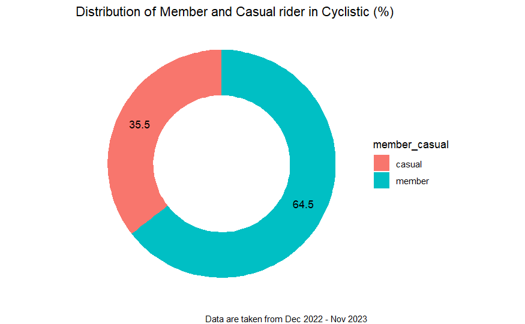
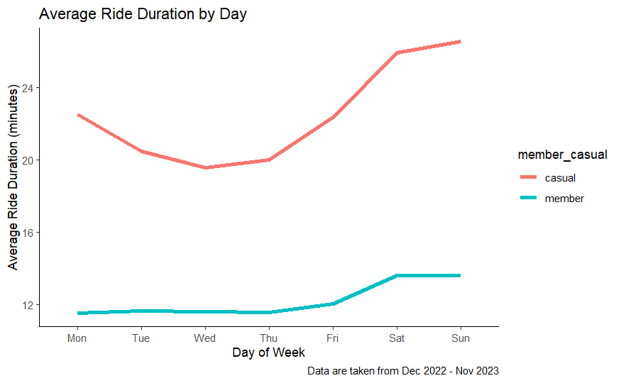

## Visualizations
The visualizations are created using R. Files are already combined and cleaned following these [steps](../README.md#process). 

### Distribution of Member and Casual rider in Cyclistic
```{r}
hsize <- 2
temp <- df_cleaned %>% 
  group_by(member_casual) %>% 
  summarise(val=n())

temp <- temp %>% 
  mutate(x=hsize)

temp <- temp %>%
  mutate(val=signif(val/sum(val)*100, digits=3))

ggplot(data=temp, aes(x=hsize, y=val, fill=member_casual)) +
  geom_col() +
  coord_polar(theta="y") +
  xlim(c(0.2, hsize + 0.5)) +
  geom_text(aes(label = val),
            position = position_stack(vjust = 0.5)) +
  labs(title="Distribution of Member and Casual rider in Cyclistic (%)",
       caption="Data are taken from Dec 2022 - Nov 2023") +
  theme_void()
```


### Number of Rides by Day
```{r warning=FALSE}
temp <- df_cleaned %>% 
  group_by(member_casual, day_of_week) %>% 
  summarize(total_rides=n())

temp <- temp %>% 
  mutate(day=(day_of_week - 2) %% 7)

ggplot(data=temp) +
  geom_line(mapping=aes(x=factor(day), y=total_rides, group=member_casual, color=member_casual), linewidth = 1.5, ) +
  xlab("Day of Week") +
  ylab("Total Rides") +
  theme_classic() +
  theme(panel.border = element_blank(),
        panel.grid.major = element_blank(),
        panel.grid.minor = element_blank()) +
  labs(title="Number of Rides by Day",
       caption="Data are taken from Dec 2022 - Nov 2023") +
  scale_x_discrete(labels=c('Mon', 'Tue', 'Wed', 'Thu', 'Fri', 'Sat', 'Sun'))
  
```


### Average Ride Duration by Day
```{r warning=FALSE}
temp <- df_cleaned %>% 
  group_by(member_casual, day_of_week) %>% 
  summarize(avg_ride_length=mean(ride_length))

temp <- temp %>% 
  mutate(day=(day_of_week - 2) %% 7)

ggplot(data=temp) +
  geom_line(mapping=aes(x=factor(day), y=avg_ride_length / 60, group=member_casual, color=member_casual), linewidth = 1.5, ) +
  xlab("Day of Week") +
  ylab("Average Ride Duration (minutes)") +
  theme_classic() +
  theme(panel.border = element_blank(),
        panel.grid.major = element_blank(),
        panel.grid.minor = element_blank()) +
  labs(title="Average Ride Duration by Day",
       caption="Data are taken from Dec 2022 - Nov 2023") +
  scale_x_discrete(labels=c('Mon', 'Tue', 'Wed', 'Thu', 'Fri', 'Sat', 'Sun'))
```


### Distribution of Rideable Type in Cyclistic
```{r warning=FALSE}
temp <- df_cleaned %>% 
  group_by(rideable_type, member_casual) %>% 
  summarize(count_type=n())

ggplot(data=df_cleaned) +
  geom_bar(mapping=aes(x=rideable_type, fill=rideable_type), show.legend=FALSE) +
  labs(title="Distribution of Rideable Type in Cyclistic",
       caption="Data are taken from Dec 2022 - Nov 2023") +
  xlab("Rideable Type") +
  ylab("") +
  scale_x_discrete(labels=c('Classic', 'Docked', 'Electric')) +
  facet_wrap(~member_casual) +
  theme_classic()
```

